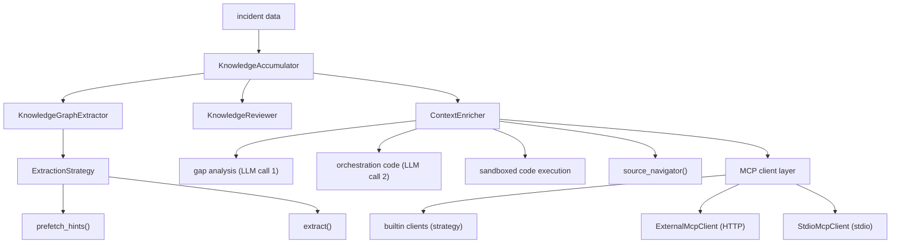
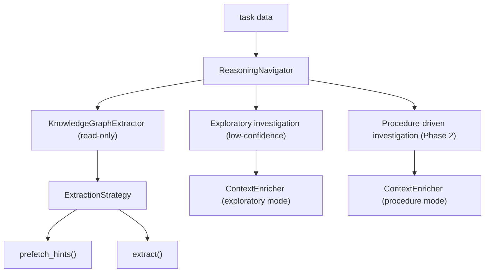
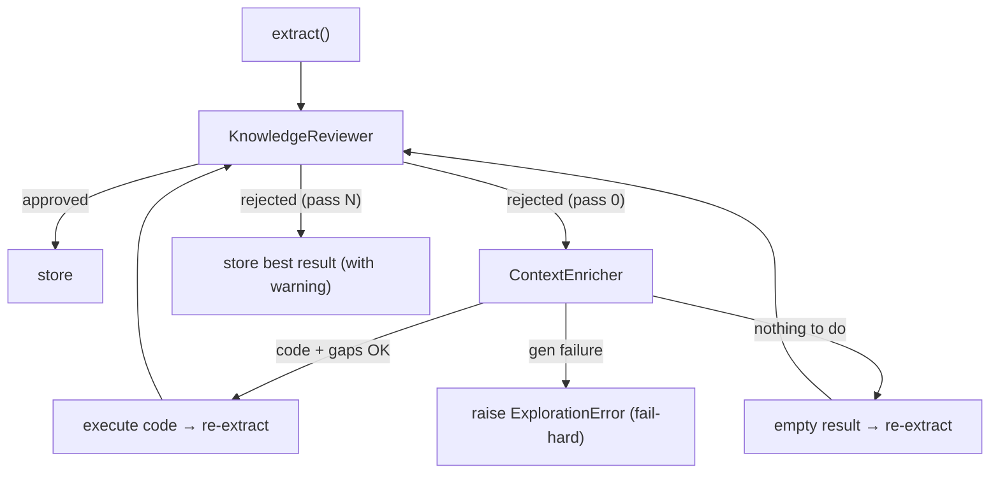

Bamboo is built around two main pipelines, each composed of several cooperating agents.
The **Knowledge Accumulation** pipeline learns from resolved incidents and builds the knowledge
databases.  The **Reasoning Navigation** pipeline diagnoses new incidents by querying those
databases.  Both pipelines share the same extraction layer; the accumulation pipeline also
includes an optional quality-gate loop.

---

## Pipeline Overview




The **review–explore loop** inside `KnowledgeAccumulator` always runs:



---

## Knowledge Accumulation Pipeline

### `KnowledgeAccumulator`

**File:** `bamboo/agents/knowledge_accumulator.py`

The top-level orchestrator for knowledge accumulation.  Given the raw data for one resolved
incident it runs the full pipeline: extraction, optional review, database storage, and vector
indexing.

**Inputs** (all optional except at least one of `email_text` / `task_data`):

| Parameter | Type | Description |
|---|---|---|
| `email_text` | `str` | Full email thread from the incident |
| `task_data` | `dict` | Structured task/system fields |
| `external_data` | `dict` | Supplementary key→value metadata |
| `task_logs` | `dict[str, str]` | Task-level logs keyed by source name (e.g. `"scheduler"`) |
| `dry_run` | `bool` | Skip all DB writes; useful for `bamboo extract` previews |

**Output:** `ExtractedKnowledge` — graph, narrative summary, vector key insights, metadata.

**Configuration:**

| Setting | Default | Effect |
|---|---|---|
| `--max-retries N` | `2` | Reviewer retry limit (`bamboo extract` CLI only) |

**Retry loop:** on each rejection the accumulator increments `attempt`.  The
`ContextEnricher` fires exactly once (at `attempt == 0`).  After
`max_review_retries` rejections the best result is stored with a warning.

---

### `KnowledgeGraphExtractor`

**File:** `bamboo/agents/extractors/knowledge_graph_extractor.py`

A thin dispatcher that selects the active extraction strategy, calls it, and assigns a stable
UUID to every returned node.  Neither the accumulator nor the reasoning navigator talk to an
extraction strategy directly — they always go through this class.

**Configuration:** `EXTRACTION_STRATEGY` env var (default: `"panda"`).  See
[Extraction Strategy Plugin System](/bamboo/architecture/extraction-plugin-system/) for adding custom strategies.

The default strategy (`"panda"`) is `PandaKnowledgeExtractor` — see [PanDA Integration](/bamboo/integrations/panda-integration/) for its input routing and canonicalisation details.

---

### `KnowledgeReviewer`

**File:** `bamboo/agents/knowledge_reviewer.py`

An LLM-based quality gate that evaluates the extracted graph for completeness *before* it is
written to the databases.  It acts as a **gap analyzer** — it identifies information that
should be present but is missing — rather than cross-checking against source text.

**Gap categories:**

| Category | Example |
|---|---|
| Structural | `SymptomNode` with no `CauseNode` explaining it |
| Specificity | Node named `"error"` with no error code or detail |
| Contextual | `SymptomNode` present but no `CauseNode` reachable via graph traversal |

**Grounding rule:** the LLM may only flag a gap if it is implied by (a) the graph structure
itself or (b) the available task context fields.  Speculation beyond the provided data is
prohibited.

**MCP tool awareness:** the reviewer receives the full MCP tool catalogue at review time.
When a gap could be resolved by a specific tool, the reviewer annotates the issue string
accordingly — e.g. `"SymptomNode present but no Cause found → resolvable with get_task_logs"`.
This makes the explorer's downstream tool-selection more reliable without changing the
`ReviewResult` schema.  The reviewer only sees tools that are statically registered (built-in
tools are always available; external server tools appear after the first `connect()`).

**Fail-open:** any LLM or parse error returns `approved=True` so a reviewer malfunction
never blocks the accumulation pipeline.

**Output:** `ReviewResult` — `approved`, `confidence`, `issues` (list of gap descriptions,
optionally annotated with `→ resolvable with <tool>`), `feedback` (actionable instruction
for the extractor on retry).

---

### `ContextEnricher`  *(fires once per run)*

**File:** `bamboo/agents/context_enricher.py`

Combined planner + executor for MCP tool calls. Sits between the first reviewer
rejection and the second extraction attempt in the accumulation pipeline, and
also runs from `ReasoningNavigator` for low-confidence or procedure-driven
investigation. Produces Python orchestration code rather than static tool-call
JSON, so dependent tool chains (e.g.
`find_similar_successful_tasks` → `get_successful_job_logs(task_id=…)`) are
expressed natively.

**Two LLM calls per run:**

**Call 1 — Gap analysis** (`EXPLORATION_GAP_ANALYSIS_SYSTEM` + `EXPLORATION_GAP_ANALYSIS_USER`):  
Given reviewer issues (or, in procedure mode, historical procedure strings) plus
the available tool catalogue, produce precise, tool-neutral gap descriptions —
*what* specific information is missing and *why* it matters. Shown as a
`[planner: gap analysis]` panel in verbose mode. **Skipped** when called with
`skip_gap_analysis=True` (procedure-driven path); the issues themselves are
treated as the gaps.

**Call 2 — Orchestration-code generation**:  
The LLM emits a JSON object with two fields: `orchestration_code` (the body of
an async Python function that calls the tools) and `capability_gaps` (a list of
investigation directions no available tool can address). The prompt template
switches by `mode`:

| Mode | Prompt | Used when |
|---|---|---|
| `"exploratory"` *(default)* | `TOOL_ORCHESTRATION_CODE_SYSTEM` + `TOOL_ORCHESTRATION_CODE_USER` | Reviewer-issue exploration; ReasoningNavigator low-confidence path |
| `"procedure"` | `PROCEDURE_ORCHESTRATION_CODE_SYSTEM` + `PROCEDURE_ORCHESTRATION_CODE_USER` | Procedure-driven path (`skip_gap_analysis=True`); embeds historical parameters as literal values, forbids speculative tool calls |

**Sandboxed execution** (`_run_orchestration_code`):  
The generated function body runs as `async def _fn(tools, asyncio)` in a
restricted namespace exposing only a curated `_SAFE_BUILTINS`, `asyncio`, and
a `ToolProxy` (which auto-injects `task_data` for tools that accept it). A
timeout guards against runaway code. Any syntax error, runtime
exception, or timeout is logged and the call returns `{}` — fail-open.
Because the explorer runs in **automatic, read-only** phases, its tool list is
filtered to `read_only=True` tools (`_filtered_tools`) *and* it passes
`allowed_tools = <read_only names>` to the `ToolProxy`, which refuses any
state-changing (`read_only=False`) call at the call site (alias-proof) — external
PanDA *reads* are still allowed. State changes only ever happen in `investigate`'s
interactive loop. See [EXECUTION_TRUST.md](/bamboo/architecture/execution-trust/).

### Bounding the tool list for large catalogues

When many external MCP servers are configured the catalogue can grow to hundreds
of tools — too many to dump (with full JSON schemas) into every orchestration
prompt, especially for a small-context local LLM. `bamboo.agents.helpers.tool_selection`
bounds it:

- **Two controls (see `config.py`), no behaviour change when small.** (1) *Truncation
  backstop* — the tool block is rendered to fit `resolve_context_window(settings) −
  (rest of the prompt) − tool_budget_margin`, measured greedily against the *real*
  assembled prompt with the model's tokenizer (`get_token_counter`). `llm_context_window`
  is auto-detected (Ollama: the *served* window from `/api/ps`; cloud: a constant; `0`
  = auto). (2) *Relevance cap* — at most `tool_max_full_schemas` tools get full schemas
  **even when the whole catalogue fits**, because too many full schemas hurt selection
  accuracy and cost. Selection runs when the block is over budget **or** the catalogue
  exceeds the cap; for a small catalogue under the cap all tools are shown full exactly
  as before — no retrieval, no vector writes.
- **When triggered → two-source retrieval** (`ToolSelector.select`). Source #1: tools
  used by *similar human-approved past investigations* (the `ProcedureTriggers`
  vector section, keyed on the originating prompt + `trigger_signals`); source #2:
  tools whose descriptions match the symptom (`ToolCatalogue`). The top
  `tool_max_full_schemas` get full schemas, the rest a compact one-liner, the overflow
  is omitted (logged). `tool_retrieval_candidate_k` (auto = `max(40, 3 ×
  tool_max_full_schemas)`) sizes the ranking pool; a `tool_reserved_explore` quota
  guarantees source #2 some slots so newly-added tools are never crowded out.
- **Selection trims the *prompt* only — never the runtime allow-set.** The
  `ToolProxy` still permits any contextually-valid tool, so a tool omitted from the
  prompt is never *refused* if the LLM names it. No extra LLM call on the common
  path: the codegen LLM picks from what it sees. If it declines ("no tool fits")
  while tools were omitted, `investigate` escalates once with a fresh candidate page.
- **Self-healing source #1.** Each human-approved investigate run is indexed as a
  `(prompt → tools)` example (`_index_approved_run`); runs finalised with a Cause are
  re-indexed at a higher weight. So a tool that source #2 surfaced and the operator
  approved seeds source #1 for next time.
- **Failure modes:** over budget + vector store unreachable → `investigate` aborts
  the turn with a clear error (no degraded continuation); the automatic explorer
  instead degrades to a budget-truncated compact list (it is best-effort). All
  vectors are namespaced by `config_namespace` (hash of `MCP_SERVERS_CONFIG` +
  provider) so a shared Qdrant isn't thrashed by differently-configured instances.

**Tuning (`.env`):**

```env
LLM_CONTEXT_WINDOW=0          # 0 = auto-detect (Ollama: served window from /api/ps; cloud: a constant)
TOOL_BUDGET_MARGIN=1024       # tokens reserved for the response + headroom
TOOL_MAX_FULL_SCHEMAS=25      # primary knob: max tools shown with a full schema
#TOOL_RETRIEVAL_CANDIDATE_K=0 # advanced: ranking pool; 0 = max(40, 3×the cap)
```

**Reusable procedures as tools** (`bamboo/agents/procedure_tools.py`): a captured
`ProcedureNode` is identified by a **tool-call signature** (`procedure_signature` /
`procedure_tool_name`) — the set of `tools.<name>` its code calls — which is its
stable dedup key (replacing the free-text `strategy_type`; the cause is an edge).
`build_procedure_tools_registry` turns approved, non-trivial (≥2-tool), read-only
procedures into callable `proc__…` tools whose handler replays the stored code via
`run_orchestration_code` (so the read-only boundary composes). `InvestigationOrchestrator`
loads them cause-agnostically via `GraphDatabaseClient.find_all_procedures(limit=N)`
(ordered by reuse frequency) and adds them to the planner's registry, so the LLM can
reuse prior work by calling `tools.proc__…()`. (Exposure-only this phase — the reused
code is still reviewed per turn; no durable auto-run.)

**Returned data** (`ExplorationResult`):

- `task_logs` — log content keyed by source label
- `external_data` — structured tool outputs; the orchestration return dict is
  stored under `external_data["orchestration:<key>"]`
- `tool_calls` — record of tools that ran (observability)
- `capability_gaps` — investigation directions no available tool addresses;
  each entry has `"investigation"` and `"suggested_tool_capability"`. Empty
  when the LLM did not flag any gap.

**Failure contract (no fallback path):**  
`explore()` has a single path — the orchestration-code path. It distinguishes
*nothing to do* from *failure*:

- **Nothing to do** → empty `ExplorationResult` (re-extraction proceeds
  unenriched): no review issues / task data, no available tools, or the planner
  found no actionable gaps. Empty code accompanied by `capability_gaps` (every
  gap needs a tool that does not exist) is also legitimate — gaps are recorded,
  nothing runs.
- **Genuine generation failure** → raises `ExplorationError`: the LLM returned
  neither runnable code nor any capability gap (malformed/empty/parse failure),
  or an exception occurred during planning. The explorer **fails hard** rather
  than silently degrade. Every caller catches it at a per-invocation boundary
  (`bamboo populate` marks the task failed and continues the batch; `analyze`/
  `investigate` report the error for that run).

**Hard-routed branches:**  
The reviewer issue marker `"no investigation procedure captured"` is routed
deterministically (in Python, before the planner runs) to the
`request_human_input` tool — the LLM consistently mis-routed this kind of gap.

**Operational notes:**

- The MCP client is `connect()`-ed on entry and `close()`-d on exit.
- The explorer fires **at most once** per accumulation run (at `attempt == 0`).
- Any individual tool failure is logged and skipped — the pipeline never stalls.
- Results from unrecognised tools (e.g. external MCP servers) are stored in
  `external_data` under `"tool:<name>"` and forwarded to the LLM extractor as
  additional unstructured context.

---

### MCP Client Layer

The MCP client is built by `build_mcp_client()` in `bamboo/mcp/factory.py` and passed to
`ContextEnricher` at startup.  When no external servers are configured it returns a bare
`PandaMcpClient`; otherwise it returns a `CompositeMcpClient` that aggregates `PandaMcpClient`
with one or more `ExternalMcpClient` instances.

#### Built-in MCP client

A **built-in MCP client** is always included by `build_mcp_client()`.  It exposes
system-specific tools (task data fetching, log retrieval, documentation search, source
navigation).  See [PanDA Integration](/bamboo/integrations/panda-integration/) for the full tool catalogue when
using the PanDA strategy.

#### `ExternalMcpClient`

**File:** `bamboo/mcp/external_mcp_client.py`

Connects to one external MCP server using the **StreamableHTTP** transport from the official
`mcp` Python SDK.  Tools are discovered at connect time via `session.list_tools()` and are
presented to the LLM alongside the built-in tools.

- The `mcp` package is a main dependency — no extra install needed.
- If the `mcp` package is missing or the server is unreachable, `connect()` logs the error
  and this client contributes zero tools — the pipeline continues with built-in tools only.

#### `StdioMcpClient`

**File:** `bamboo/mcp/external_mcp_client.py`

Connects to one external MCP server using the **stdio** transport: bamboo spawns the server
as a subprocess and communicates over its stdin/stdout.  No separately-running server process
is needed — bamboo manages the subprocess lifetime automatically.

- Same `mcp` package requirement and fail-open behaviour as `ExternalMcpClient`.
- The subprocess inherits the current environment plus any extra variables declared in the
  `env` field of the server config entry.

#### `CompositeMcpClient`

**File:** `bamboo/mcp/external_mcp_client.py`

Aggregates any number of `McpClient` instances (built-in, HTTP, stdio) into one.
The built-in client is always first, so its tool names win on any name clash with external servers.

#### Configuring external MCP servers

External servers are declared in a JSON file referenced by `MCP_SERVERS_CONFIG`.  Each entry
must specify **exactly one** transport — `url` (HTTP) or `command` (stdio).

**HTTP transport:**

```json
{
  "servers": [
    {
      "name": "my_atlas",
      "url": "http://localhost:8080/mcp",
      "headers": {"Authorization": "Bearer ${ATLAS_TOKEN}"},
      "enabled": true
    }
  ]
}
```

**stdio transport:**

```json
{
  "servers": [
    {
      "name": "my_server",
      "command": "python3",
      "args": ["-m", "mypackage.server"],
      "env": {"PYTHONPATH": "/path/to/mypackage"},
      "enabled": true
    }
  ]
}
```

Header and `env` values support `${ENV_VAR}` expansion.  Point to the file via `.env`:

```
MCP_SERVERS_CONFIG=/path/to/mcp_servers.json
```

See `bamboo/mcp/server_config.py` for the full schema.

---

## Reasoning Navigation Pipeline

### `ReasoningNavigator`

**File:** `bamboo/agents/reasoning_navigator.py`

Diagnoses a problematic task by querying the knowledge databases built by the accumulation
pipeline, then drafts a resolution email for the task submitter.

**Steps:**

1. **Extract clues** — run `KnowledgeGraphExtractor` on the task's structured fields to
   identify symptoms, task features, job features, environment factors, and components.
2. **Graph DB query** — find candidate causes ranked by how many clue types point to them.
   Symptoms with no known causes are collected as *novel leads* (returned alongside results).
3. **Vector DB retrieval** — two-step:
   a. Search node descriptions for similar past incidents (returns `graph_id` values).
   b. Fetch narrative summaries for those graphs.
4. **Initial LLM diagnosis** — synthesise graph evidence + semantic evidence into a root-cause
   statement with confidence score.  Always runs, even when graph or vector results are empty.
5. **Exploratory investigation** *(if `confidence < EXPLORATORY_INVESTIGATION_THRESHOLD`,
   default 0.5)* — synthesise review-issue strings from the initial root cause,
   partial graph DB candidates, and novel unmatched symptoms; call
   `ContextEnricher.explore()` in **exploratory mode**.  The enricher's
   orchestration-code path picks tools and natively chains dependent calls;
   root-cause is then re-synthesised with the gathered evidence.  Any
   `capability_gaps` returned (investigation directions no tool addresses) are
   surfaced in the final result.
6. **Procedure-driven investigation** *(Phase 2, if a known cause was identified)* — query
   graph DB for `ProcedureNode` entries linked to the cause; convert each procedure into a
   review-issue string and call `ContextEnricher.explore(skip_gap_analysis=True)`, which
   switches to **procedure mode** (historical parameters embedded as literals, no speculative
   tool calls).
7. **Email draft** — generate a professional resolution email for the task submitter.

**Output:** `AnalysisResult` — `root_cause`, `confidence`, `resolution`, `explanation`,
`supporting_evidence`, `capability_gaps`, `email_content`.

`capability_gaps` is a list of investigation directions that no available MCP tool could
address during exploratory investigation.  Each entry has `"investigation"` (what would be
checked) and `"suggested_tool_capability"` (what a future tool would need to do).  Empty when
confidence was high enough to skip exploratory investigation or no explorer is configured.

---

## Configuration Reference

| Environment variable | Default | Affects |
|---|---|---|
| `EXTRACTION_STRATEGY` | `panda` | `KnowledgeGraphExtractor` strategy selection |
| `LLM_PROVIDER` | `openai` | All LLM calls across all agents |
| `LLM_MODEL` | `gpt-4-turbo-preview` | All LLM calls across all agents |
| `MCP_SERVERS_CONFIG` | _(empty)_ | Path to JSON file listing external MCP servers |

The `--max-retries N` flag on `bamboo extract` overrides the reviewer retry limit for a single
run without changing the default.

---

## Failure Handling

Most agents follow a **fail-open** policy: if an optional sub-component errors, the pipeline
continues with what it has rather than aborting. The exception is the explorer's
code-generation step, which **fails hard** (see `ContextEnricher.explore`'s failure
contract above) so a genuine generation failure is surfaced rather than masked by a
thin result.

| Component | On failure |
|---|---|
| `KnowledgeReviewer` LLM call | Returns `approved=True`, logs exception |
| `ContextEnricher._analyse_gaps` LLM call | Returns `[]` → no actionable gaps → empty `ExplorationResult` (re-extract unenriched) |
| `ContextEnricher._generate_orchestration_code` | Legitimate no-op (no gaps / no tools) → `None` → empty result; genuine failure (no code and no capability gaps, or an exception) → **raises `ExplorationError`** |
| `ContextEnricher._run_orchestration_code` (syntax / runtime / timeout) | Logs warning, returns `{}` — no tool results that round |
| `ReasoningNavigator._run_exploratory_investigation()` (no explorer) | Returns `(None, [])`, skips exploratory investigation silently |
| Individual MCP tool call | Logs warning, skips that tool's result |
| `ExternalMcpClient` connect (server down) | Logs warning, contributes zero tools; built-in tools still available |
| `ExternalMcpClient` connect (`mcp` not installed) | Logs install hint, contributes zero tools |
| `StdioMcpClient` connect (subprocess fails) | Logs warning, contributes zero tools; built-in tools still available |
| `StdioMcpClient` connect (`mcp` not installed) | Logs install hint, contributes zero tools |
| `ExtractionStrategy.source_navigator().navigate()` exception | `prefetch_hints` logs warning, returns `{}` — doc_hints has no source entry |
| `KnowledgeReviewer` repeated rejection | Stores best result after `max_review_retries`, logs warning |
