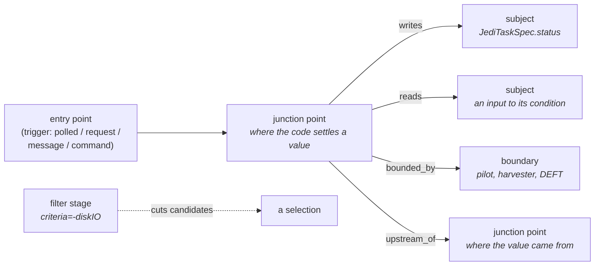
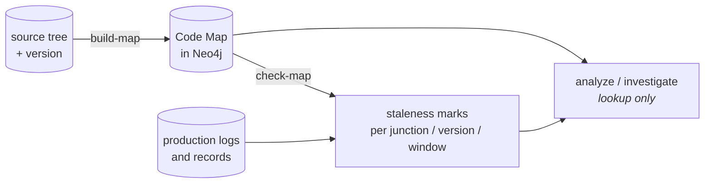

Most of Bamboo starts from something the system said — an error message, a diagnostic, a
failed job. The Code Map is for the investigations that start from nothing of the kind:
*the task is not moving*, *the jobs are going to the wrong sites*, *this is slower than it
should be*. There is no string to search for, so there is nothing to retrieve, and the
[PanDA source navigator](/bamboo/architecture/agents/) — grep terms out of free text,
rank thirty candidates — fails in exactly the way its own evaluation classifies:
`no_candidates`, `too_many_candidates`, `irrelevant`. All three are retrieval failures,
not comprehension failures.

So the Code Map replaces the retrieval. It is a graph **extracted from the source by a
machine**, in which the question "where is this decided?" is an index lookup rather than
a search.

This page is the mental model and the vocabulary. Two companion pages cover the rest:
[Building the map](/bamboo/architecture/code-map-building/) for how the extraction works,
and [Verifying the map](/bamboo/architecture/code-map-verification/) for how it checks
itself and how to read what it reports. None of the three restates the module docstrings,
which carry the reasoning for each individual decision and are linked at the right
moments.

## One question

The Code Map is shaped around a single question — **which branch fired, and why** — and
its usefulness comes from how many operational symptoms turn out to be that question in
disguise:

| Symptom | What it asks of the branch table |
|---|---|
| Stalled, not progressing | A `NO_TRANSITION` branch fired — a lock was held, the state was out of scope |
| Went to the wrong state | Branch B fired where the operator expected A |
| The distribution is wrong | Which stage of the filter chain cut the candidates |
| There is an error string | The branch that fired also wrote that line, so the lookup is one hop |

## The node kinds

**Subject** — an attribute worth asking *why is it this value?* about. Not every
attribute: PanDA's spec classes declare 421 of them and most are identifiers, timestamps
and counters. A subject is one that survived
[promotion](/bamboo/architecture/code-map-building/#promotion-which-attributes-become-subjects),
and its name is always
qualified — `FileSpec.status` and `JediFileSpec.status` are different fields that happen
to share a word.

**Junction point** — a place the code settles a subject's value. Its `branches` are the
possible outcomes, each with the `path_condition` that selects it: the conjunction of the
`if`/`elif`/`else` tests dominating the write.

:::note[Why not "decision point"]
A junction does not *judge*. Which branch is taken follows deterministically from the
conditions, like a railway switch. Bamboo reserves **decision point** for the constrained
places where an LLM or a human actually chooses, and the two must not be confused when
reading a trace.
:::

**Branch** — `outcome` + `path_condition` + `tier`. The outcome is a value, or
`passthrough(<field>)` when it is carried from somewhere else, or `NO_TRANSITION`.

**Filter stage** — one reason a candidate was dropped on the way to a selection. Separate
from a junction because brokerage never *picks* a site: it starts with every site and
narrows the list about twenty-five times, so every stage runs and each removes some. A
junction's branches are alternatives and one wins; a chain's stages are cumulative.

**Boundary** — where causation crosses into a system this map does not cover: the pilot,
Harvester, DEFT, a message broker. Modelled explicitly rather than left as an absence, so
that adding another system's map later is a *binding* operation instead of a
re-derivation.

**Entry point and trigger** — how control reaches a junction. The same junction can have
several, and the trigger kind decides something an investigation needs to know first:
whether a missed opportunity repairs itself.

| Trigger | Self-repairing? | Is there evidence it did not arrive? |
|---|---|---|
| `polled` | Yes — re-evaluated next cycle | n/a |
| `request` | No — consumed once | Yes, in the HTTP layer |
| `command` | No | **Yes** — the row is in the database |
| `message` | No | **No** — a consumer that never received anything is silent |

That last row is why "is this stall going to clear on its own?" is answerable from the
map at all.

## Tier 1 and tier 2

About a third of the branches in the PanDA map do not have a statically resolvable
outcome — the writer is known but the value is only settled at run time. They are on the
map anyway, marked **tier 2**.

This is deliberate and it is the difference between an honest map and a misleading one. A
junction whose run-time branches were simply dropped reads as *"this site always produces
`ready`"*, which is false. Marked tier 2, it reads as *"this site writes the field, and
what it writes is decided when it runs"*, which is true and still useful: locating the
anomaly and eliminating candidates both work from observed values, so neither needs the
outcome resolved in advance.

So the extraction's completion condition is **not** "resolve every outcome". It is
**"every writer on the map, with its tier stated"**. As built against
`panda-server-source` 1.0.2, that is 1042 branches, 66% tier 1.

## Three cadences

The map is built, checked, and used on three different schedules, and the separation is
load-bearing rather than tidiness.

- **Build** — offline, once per source version. Minutes. Writes to the database.
- **Validate** — periodic, against production. The map has not changed; only how much of
  it you should trust has. This is a separate cadence *because* those two things move
  independently.
- **Use** — per incident. Seconds. Lookup only: `analyze` never rebuilds inline, so an
  unattended run stays read-only and reports a degraded result instead of quietly
  repairing itself.

Build and validate are a pair. Without the second, nobody notices the first stopped being
run, and a map nobody rebuilt goes stale in silence. See
[Verifying the map](/bamboo/architecture/code-map-verification/).

## Version skew is the normal case

Bamboo reads source from its own environment and talks to a production deployment
elsewhere. **The code it reads is not the code that is running**, and the gap is not an
exceptional condition to be handled but the standing state of affairs.

The design absorbs it in three ways. Identity is a **semantic signature**, never a file
position — between `panda-server-source` 0.8.1 and 1.0.2 the pilot boundary moved file
entirely (`jobdispatcher/JobDispatcher.py` disappeared; the entry is now
`api/v1/pilot_api.py::update_job`) while remaining the same boundary, and comparing two
recent trees showed 321 nodes that moved without changing. Every node carries the version
it was derived from. And `bamboo diff-map` compares two source trees directly, which is
the only way to catch the one kind of drift the production gates cannot see: a threshold
or a condition that changed without changing anything the logs echo.

Skew does not degrade everything equally. Locating the anomaly and eliminating candidates
read observed output, so they are unaffected; it is the *explanation* of a condition that
becomes untrustworthy, and only for the junctions the gates flag.

## What exists today

Extraction and verification are complete and gate-checked. Against
`panda-server-source` 1.0.2 the map holds 100 subjects, 498 junction points, 109 filter
stages, 101 boundaries and 178 value enumerations, and `check-map` reports no map defects
against production logs and job records. The figures here are from `build-map`'s own
output at that version and will move — **the command is always the authority, not this
page**.

What does not exist yet is the layer above: deriving an investigation strategy from the
map (locate → look up → eliminate → enumerate → observe → recurse). That is the reason
the map was built, and it will get its own page when it runs.

## Where to go next

- [Building the map](/bamboo/architecture/code-map-building/) — the slices, attribution,
  promotion, and `build-map`
- [Verifying the map](/bamboo/architecture/code-map-verification/) — the gates, `check-map`,
  and how to read a report
- [Graph Schema](/bamboo/architecture/schema/) — the labels, and why the Code Map is a
  separate namespace in the same database
