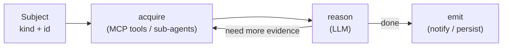

This guide is for contributors adding new capabilities to Bamboo — a new tool, a new sub-agent, or a
whole new pipeline. It teaches the **mental model** (the shape every pipeline shares, and the two
kinds of pipeline) so you can decide *what* to build, then points you at the real files for the
*how*. It deliberately does not restate the reference material that already lives in the
[Agent Reference](/bamboo/architecture/agents/), [Execution Trust](/bamboo/architecture/execution-trust/),
[Extraction Strategy Plugin System](/bamboo/architecture/extraction-plugin-system/),
[Graph Schema](/bamboo/architecture/schema/), and [PanDA Integration](/bamboo/integrations/panda-integration/)
pages — it links to them at the right moments.

## The shared skeleton

Every Bamboo pipeline, however heavy or light, is the same four-stage shape over a **subject** (the
thing being analysed — today a PanDA task, in future a job, a system component, an error code, …):



- **acquire** — gather the evidence the LLM will reason over, by calling MCP tools and sub-agents.
  The tool layer (`build_mcp_client()`, built-in + external servers) is documented in the Agent
  Reference [MCP Client Layer](/bamboo/architecture/agents/#mcp-client-layer).
- **reason** — one or more LLM calls. Use `get_llm()` for prose and `get_extraction_llm()`
  (temperature 0) for deterministic JSON — see
  [`bamboo/llm/llm_client.py`](https://github.com/tmaeno/bamboo/blob/master/bamboo/llm/llm_client.py).
- **emit** — do something with the result: post to Mattermost, draft an email, or persist to the
  knowledge databases.

The `acquire ⇄ reason` arrow is a **loop**, not a single pass: the LLM reasons over what it has and
may go back for more evidence — calling further tools or sub-agents — before it emits. The loop is
shallow for thin pipelines and deeper for full ones; Bamboo realizes it through orchestration-code
tool chaining and the review–explore / exploratory-investigation loops shown in the
[Agent Reference](/bamboo/architecture/agents/).

What differs between pipelines is **how deep the `reason` stage goes** and **what `emit` produces**.
That difference is the next section, and it is the most important thing to understand before you
build anything.

## Two pipeline shapes: thin vs full

There are two shapes. They share the skeleton above; they differ in whether they touch the knowledge
graph and what they output.

|  | **thin** | **full (diagnosis)** |
|---|---|---|
| stages | acquire → LLM → emit | acquire → extract graph → query KB (graph + vector) → diagnose → emit |
| knowledge graph / KB | not used | central (Neo4j + Qdrant) |
| output | a message / suggestion (its own small schema) | `AnalysisResult` — root cause, resolution, evidence |
| learns over time | no | yes — accumulates knowledge across incidents |
| when to use | **describe / explain / classify / notify** about a subject | **diagnose a failing unit** against accumulated knowledge |
| exists today? | built from existing primitives; runs now | yes — but for the **task** subject only |

**How to choose:**

- If you just need to *describe, explain, classify, or notify* about a subject — gather some
  evidence, ask the LLM, send the answer — build a **thin** pipeline. It needs no knowledge graph
  and is a small standalone command you can write today.
- If you need to *diagnose a failing unit* by matching it against everything Bamboo has learned, and
  you want the system to keep learning, you are in **full** territory — the
  [Knowledge Accumulation and Reasoning Navigation pipelines](/bamboo/architecture/agents/). Today
  that machinery is wired for the **task** subject; see
  [Beyond task](#beyond-task-generalizing-to-other-subjects) below.

**Examples.** Thin: "summarise a subject's recent errors and post a digest to Mattermost." Full: the
existing task analysis (`bamboo analyze`) — extract a graph from the task, query past causes, and
produce an `AnalysisResult`; its internals are in the
[Reasoning Navigation Pipeline](/bamboo/architecture/agents/#reasoning-navigation-pipeline).

## Add or modify a sub-agent / MCP tool

A **sub-agent** is a small, focused LLM helper with its own data access (e.g. `PandaSourceNavigator`
in [`bamboo/agents/panda_source_navigator.py`](https://github.com/tmaeno/bamboo/blob/master/bamboo/agents/panda_source_navigator.py),
which navigates panda-server source to answer a code question). Sub-agents are surfaced to the rest
of the system as **MCP tools** — named, described, schema-bearing callables the LLM can invoke during
the `acquire` stage.

### Choosing a registration path

| Path | Use when | Where |
|---|---|---|
| Add a tool to the **built-in** client | the capability is PanDA-adjacent and lives in this repo | `PandaMcpClient` ([`bamboo/mcp/panda_mcp_client.py`](https://github.com/tmaeno/bamboo/blob/master/bamboo/mcp/panda_mcp_client.py)) |
| A **new built-in client** via a strategy | a self-contained in-repo capability tied to an extraction strategy | `ExtractionStrategy.builtin_mcp_clients()` ([`bamboo/agents/extractors/base.py`](https://github.com/tmaeno/bamboo/blob/master/bamboo/agents/extractors/base.py)); see [Extraction Strategy Plugin System](/bamboo/architecture/extraction-plugin-system/) |
| An **external MCP server** | the capability is owned/hosted elsewhere (another service, another team) | `MCP_SERVERS_CONFIG` — already documented under [Configuring external MCP servers](/bamboo/architecture/agents/#configuring-external-mcp-servers) |

### Adding a tool to the built-in client

Three steps in a client like `PandaMcpClient`:

1. Append an `McpTool` descriptor to `self._tools` (name, `description`, `parameters_schema`).
2. Add a `"tool_name": self._handler` entry to `self._dispatch`.
3. Implement the `async def _handler(self, ...)` method.

Two things to get right:

- **`task_data` is auto-injected.** If your handler declares a `task_data` parameter, the current
  subject's data is passed in automatically — `task_data_tools()` discovers this by inspecting
  handler signatures ([`panda_mcp_client.py`](https://github.com/tmaeno/bamboo/blob/master/bamboo/mcp/panda_mcp_client.py)),
  so you never thread an id through generated code.
- **Set the trust flags.** `McpTool` carries `read_only` and `external_access`
  ([`bamboo/mcp/base.py`](https://github.com/tmaeno/bamboo/blob/master/bamboo/mcp/base.py)).
  Automatic, unattended phases run **only** `read_only=True` tools — a state-changing tool will be
  refused outside the interactive loop. Read [Execution Trust](/bamboo/architecture/execution-trust/)
  before adding anything that mutates state.

Write the `description` for a *reader deciding whether to call the tool* — say **when** to use it and
when not to. Tool descriptions drive retrieval when the catalogue is large (see the Agent Reference
on [bounding the tool list](/bamboo/architecture/agents/#bounding-the-tool-list-for-large-catalogues)).

### Modifying an existing sub-agent

Example: make `search_panda_server_source` also search the **pilot** code. There are two edit sites,
depending on which search you mean:

- The MCP tool handler `_search_panda_server_source` greps a single package root located via
  `importlib.util.find_spec("pandaserver")`
  ([`panda_mcp_client.py`](https://github.com/tmaeno/bamboo/blob/master/bamboo/mcp/panda_mcp_client.py)) —
  generalise it to also locate and search the pilot package, and update the tool `description`.
- The richer `PandaSourceNavigator` searches `_PANDA_PACKAGES = ["pandaserver", "pandajedi"]`
  ([`panda_source_navigator.py`](https://github.com/tmaeno/bamboo/blob/master/bamboo/agents/panda_source_navigator.py)) —
  add the pilot package there for the navigator path.

In both cases the pilot source must be installed/declared as a dependency.

### Adding a new sub-agent

Example: a JIRA-ticket sub-agent. Mirror `PandaSourceNavigator` (a stateless class with a lazy
`get_extraction_llm()` and its own data access — here a JIRA REST client plus new `JIRA_*` settings
in [`bamboo/config.py`](https://github.com/tmaeno/bamboo/blob/master/bamboo/config.py)). Surface it
as a tool (e.g. `search_jira_tickets`, `read_only=True`, `external_access=True`). Pick the
registration path from the table above: a new built-in client via `builtin_mcp_clients()` if it lives
in this repo, or an external MCP server if JIRA access is owned elsewhere.

## Build a thin pipeline (a new CLI command)

The existing pipelines documented in the Agent Reference are *full*; here is how to stand up a
*thin* one. It is just the skeleton wired to existing primitives.

1. **A command.** Add a `@click.command()` `main()` in a new `bamboo/scripts/<name>.py`, then wire it
   at the bottom of [`bamboo/cli.py`](https://github.com/tmaeno/bamboo/blob/master/bamboo/cli.py)
   with `cli.add_command(main, "<name>")`. Use
   [`bamboo/scripts/analyze_task.py`](https://github.com/tmaeno/bamboo/blob/master/bamboo/scripts/analyze_task.py)
   as a template for option parsing and `asyncio.run`.
2. **Collaborators.** Get the MCP client from `build_mcp_client(get_settings())`
   ([`bamboo/mcp/factory.py`](https://github.com/tmaeno/bamboo/blob/master/bamboo/mcp/factory.py)) —
   a thin pipeline usually needs nothing more. (`build_deps()` in
   [`bamboo/agents/helpers/deps.py`](https://github.com/tmaeno/bamboo/blob/master/bamboo/agents/helpers/deps.py)
   is the heavier bundle the full pipelines use; reach for it only if you need the graph/vector DBs.)
3. **Acquire + reason.** Call tools with `await client.execute("<tool>", **kwargs)`, then ask the
   LLM. For deterministic structured output use `get_extraction_llm()` and parse the JSON;
   [`bamboo/agents/prescription_composer.py`](https://github.com/tmaeno/bamboo/blob/master/bamboo/agents/prescription_composer.py)
   is the smallest agent to copy the pattern from (`ainvoke([SystemMessage, HumanMessage])` +
   `_parse_json`). Keep prompts in
   [`bamboo/llm/prompts.py`](https://github.com/tmaeno/bamboo/blob/master/bamboo/llm/prompts.py).
4. **Emit.** Post to Mattermost by reusing `post_analysis()` / the pure `render` builders in
   [`bamboo/frontends/mattermost/poster.py`](https://github.com/tmaeno/bamboo/blob/master/bamboo/frontends/mattermost/poster.py).

A thin command is roughly:

```python
@click.command()
def main(...):
    setup_logging()
    asyncio.run(_run(...))

async def _run(...):
    settings = get_settings()
    mcp = build_mcp_client(settings)
    await mcp.connect()
    try:
        evidence = await mcp.execute("<tool>", **kwargs)   # acquire (sub-agents / tools)
        result = await reason(evidence)                    # get_extraction_llm() → small schema
        await emit(result)                                 # e.g. post to Mattermost
    finally:
        await mcp.close()
```

A thin pipeline needs **no** knowledge graph and runs today. If it runs **periodically**, note that
there is no in-process scheduler — schedule it externally (cron / systemd timer / k8s CronJob)
invoking the project-venv `bamboo` CLI, and keep any "already handled" state yourself (e.g. a small
local file), since thin pipelines do not persist to the databases.

## Beyond task: generalizing to other subjects

The full-diagnosis machinery (graph extraction, KB query, `AnalysisResult`) is currently wired for
the **task** subject. Running a *non-task* subject — a job, a component — through those same stages
needs a small **subject** abstraction so the acquisition and identity are no longer hard-coded to a
task. This is a **planned direction**, not yet built: the intent is to extract it from the real
diff once a second full-tier subject (job analysis) exists, rather than design it speculatively. Thin
pipelines do not need it — they already work for any subject today.

## Where to go next

- [Agent Reference](/bamboo/architecture/agents/) — the existing pipelines, the MCP client layer, and
  external-server configuration in full.
- [Execution Trust](/bamboo/architecture/execution-trust/) — the `read_only` / `external_access`
  trust axes and what may run unattended.
- [Extraction Strategy Plugin System](/bamboo/architecture/extraction-plugin-system/) — adding a
  strategy and its `builtin_mcp_clients()`.
- [Graph Schema](/bamboo/architecture/schema/) — node and relationship types.
- [PanDA Integration](/bamboo/integrations/panda-integration/) — the built-in PanDA tool catalogue.
