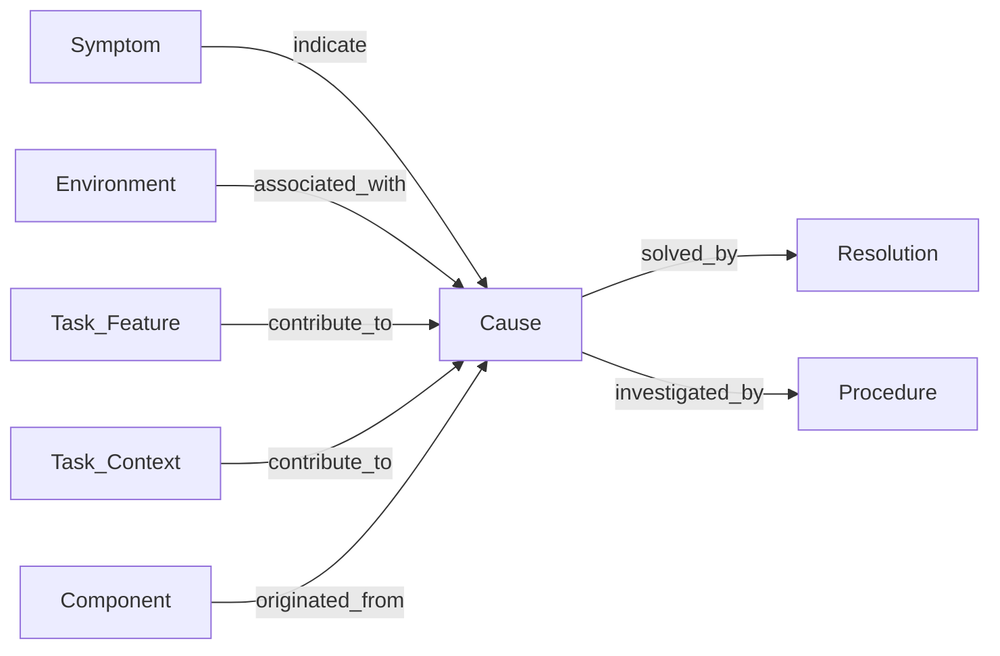
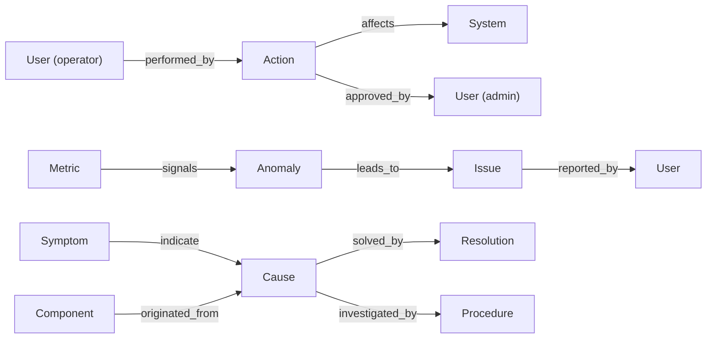

The knowledge graph schema used by the incident-analysis pipeline. Node and relationship
types are defined in `bamboo/models/graph_element.py` (`NodeType` and `RelationType`).

## Core schema

This is the subset the incident-analysis pipeline actually extracts and queries.



### Core node types

| Node | Description |
|------|-------------|
| `Symptom` | Observed failure class (e.g. error message category) |
| `Cause` | Root cause of the incident |
| `Resolution` | Solution or fix applied |
| `Procedure` | Investigation strategy for a cause type, extracted from email threads |
| `Environment` | External factor contributing to the cause (e.g. OS, runtime version) |
| `Task_Feature` | Discrete task *configuration* attribute stored as `attribute=value` (e.g. `coreCount=8`) |
| `Component` | System component where the cause originated |
| `Task_Context` | Free-form prose context — stored in vector database only, not in graph |

### Core relationships

| Relationship | From → To | Description |
|---|---|---|
| `indicate` | Symptom → Cause | Symptom points to a root cause |
| `solved_by` | Cause → Resolution | Cause is resolved by a resolution |
| `investigated_by` | Cause → Procedure | Cause is investigated by a procedure |
| `contribute_to` | Task_Feature / Task_Context → Cause | Feature or context contributes to a cause |
| `originated_from` | Component → Cause | Cause originated in a component |
| `associated_with` | Environment → Cause | Cause associated with an external factor |

### Log-level distinction

Task-level logs from orchestration services (JEDI, Harvester, …) are accepted as `task_logs`,
keyed by source name. Each source is filtered and analysed by the LLM independently; every
extracted node is tagged with `log_source` in its metadata.

## Extended catalogue

The model defines a larger set of node and relationship types — **18 node types** and
**19 relationship types** in total — available for future extraction strategies beyond the core
incident-analysis pipeline.

### Node types (18)

```
- Symptom: Symptom messages and failures
- Cause: Root causes of issues
- Resolution: Solutions and fixes
- Environment: External factors
- Task_Feature: Task configuration attributes (discrete or bucketed)
- Task_Context: Free-form prose fields stored in vector DB for semantic search
- Procedure: Investigation strategy for a cause type, extracted from email threads
- Component: System origin of causes
- Metric: System metrics and KPIs
- Anomaly: Detected anomalies
- Issue: System issues
- System: Systems and services
- Pattern: Operational patterns
- Optimization: Optimization opportunities
- Event: System events
- Action: Actions (automated/manual)
- Dependency: System dependencies
- User: Users (operators, engineers, admins)
```

### Relationship types (19)

```
Core Relationships:
- indicate: Symptom indicates Cause
- associated_with: Environment associated with Cause
- contribute_to: Task_Feature / Task_Context contributes to Cause
- originated_from: Component originated_from Cause
- solved_by: Cause solved by Resolution
- investigated_by: Cause investigated_by Procedure

System Relationships:
- signals: Metric signals Anomaly
- leads_to: Anomaly leads to Issue
- has_component: System has Component
- depends_on: Component depends on Dependency
- suggests: Pattern suggests Optimization
- improves: Optimization improves Performance
- triggers: Event triggers Action
- affects: Action affects System

User Relationships:
- performed_by: Action performed by User
- reported_by: Issue reported by User
- assigned_to: Task assigned to User
- approved_by: Action approved by User
```

### Extended graph example


