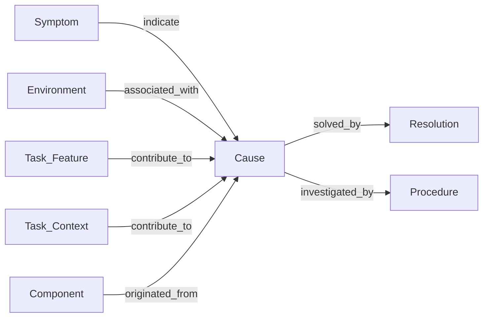
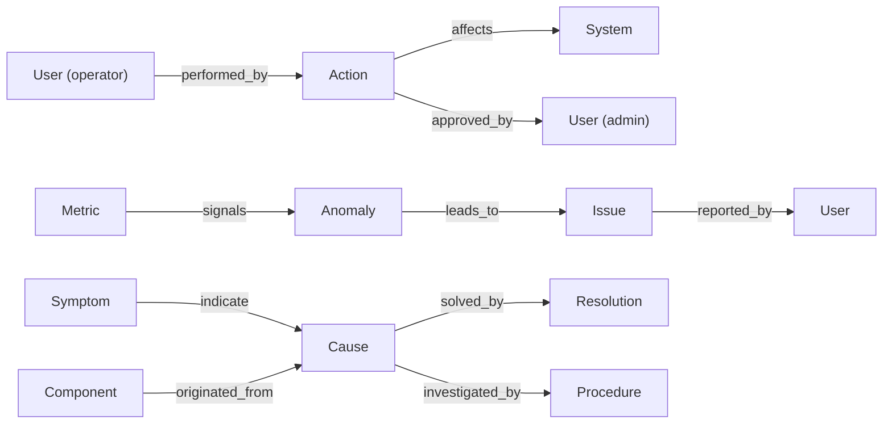

The knowledge graph schema used by the incident-analysis pipeline. Node and relationship
types are defined in `bamboo/models/graph_element.py` (`NodeType` and `RelationType`).

The same Neo4j database holds a second, separate set of labels — the
[Code Map](/bamboo/architecture/code-map/), machine-derived from source. They share a
database and nothing else; see [Two namespaces](#two-namespaces) below.

## Core schema

This is the subset the incident-analysis pipeline actually extracts and queries.


```mermaid
flowchart LR
    Symptom -->|indicate| Cause
    Cause -->|solved_by| Resolution
    Environment -->|associated_with| Cause
    Task_Feature -->|contribute_to| Cause
    Task_Context -->|contribute_to| Cause
    Component -->|originated_from| Cause
    Cause -->|investigated_by| Procedure
```

### Core node types

| Node | Description |
|------|-------------|
| `Symptom` | Observed failure class (e.g. error message category) |
| `Cause` | Root cause of the incident |
| `Resolution` | Solution or fix applied |
| `Procedure` | Investigation strategy for a cause type, extracted from email threads |
| `Environment` | External factor contributing to the cause (e.g. OS, runtime version) |
| `Task_Feature` | Discrete task *configuration* attribute stored as `attribute=value` (e.g. `coreCount=8`) |
| `Component` | System component where the cause originated |
| `Task_Context` | Free-form prose context — stored in vector database only, not in graph |

### Core relationships

| Relationship | From → To | Description |
|---|---|---|
| `indicate` | Symptom → Cause | Symptom points to a root cause |
| `solved_by` | Cause → Resolution | Cause is resolved by a resolution |
| `investigated_by` | Cause → Procedure | Cause is investigated by a procedure |
| `contribute_to` | Task_Feature / Task_Context → Cause | Feature or context contributes to a cause |
| `originated_from` | Component → Cause | Cause originated in a component |
| `associated_with` | Environment → Cause | Cause associated with an external factor |

### Log-level distinction

Task-level logs from orchestration services (JEDI, Harvester, …) are accepted as `task_logs`,
keyed by source name. Each source is filtered and analysed by the LLM independently; every
extracted node is tagged with `log_source` in its metadata.

## Two namespaces

The database holds two bodies of knowledge with opposite lifecycles, and the labels are
what keep them apart.

| | Incident graph | Code Map |
|---|---|---|
| Where it comes from | LLM extraction from incidents, human-validated | Machine-derived from source by `build-map` |
| If you lose it | Irreplaceable | Rebuild it in a minute |
| Labels | `Symptom`, `Cause`, `Resolution`, … | `Subject`, `JunctionPoint`, `FilterStage`, `Boundary`, `ValueEnum` |

That separation is not tidiness: `clear_all()` drops everything in the database, so
rebuilding a Code Map would take the incident graph with it. `clear_map(map_id)` exists
because the Code Map labels are distinct, and it is the only safe way to rebuild one.

The two join at `Component`: an incident's `Component` node and the Code Map's junctions
describe the same subsystem from opposite directions, which is what `implemented_by` is
for. See the [Code Map overview](/bamboo/architecture/code-map/) for what the Code Map
node kinds mean.

:::caution[The Code Map is stored as nodes only — no relationships yet]
`build-map` writes the five node kinds and no edges at all, so the Code Map relationship
types below are declared and not yet produced by anything. Do not write a query that
expects them.

Traversal still works, because the references are ordinary string properties rather than
edges: `JunctionPoint.subject` holds a `Subject.name`, so joining on it answers *which
code decides this value* today.

```cypher
MATCH (s:Subject {map_id: 'panda', name: 'JediTaskSpec.status'})
MATCH (j:JunctionPoint {map_id: 'panda'}) WHERE j.subject = s.name
RETURN j.owner, j.log_files          // 37 writers, and which log each lands in
```

The one reference this does not reach is a `passthrough(...)` outcome, which names where
a value was carried from. Those live inside `branches`, stored as a JSON string, so
following the chain means decoding it rather than matching a pattern. Real edges get
materialised when the backward walk needs variable-length paths, and not before.
:::

## Extended catalogue

The model defines a larger set of node and relationship types — **23 node types** and
**23 relationship types** in total — available for future extraction strategies beyond the core
incident-analysis pipeline.

### Node types (23)

```
- Symptom: Symptom messages and failures
- Cause: Root causes of issues
- Resolution: Solutions and fixes
- Environment: External factors
- Task_Feature: Task configuration attributes (discrete or bucketed)
- Task_Context: Free-form prose fields stored in vector DB for semantic search
- Procedure: Investigation strategy for a cause type, extracted from email threads
- Component: System origin of causes
- Metric: System metrics and KPIs
- Anomaly: Detected anomalies
- Issue: System issues
- System: Systems and services
- Pattern: Operational patterns
- Optimization: Optimization opportunities
- Event: System events
- Action: Actions (automated/manual)
- Dependency: System dependencies
- User: Users (operators, engineers, admins)

Code Map types (machine-derived from source, separate namespace):
- Subject: An attribute worth asking "why is it this value?" about
- JunctionPoint: A place the code settles a subject's value, with one branch per outcome
- FilterStage: One reason a candidate was dropped on the way to a selection
- Boundary: Where causation crosses into a system this map does not cover
- ValueEnum: One `NAME = value` constant, so a code seen in a record can be decoded
```

### Relationship types (23)

```
Core Relationships:
- indicate: Symptom indicates Cause
- associated_with: Environment associated with Cause
- contribute_to: Task_Feature / Task_Context contributes to Cause
- originated_from: Component originated_from Cause
- solved_by: Cause solved by Resolution
- investigated_by: Cause investigated_by Procedure

System Relationships:
- signals: Metric signals Anomaly
- leads_to: Anomaly leads to Issue
- has_component: System has Component
- depends_on: Component depends on Dependency
- suggests: Pattern suggests Optimization
- improves: Optimization improves Performance
- triggers: Event triggers Action
- affects: Action affects System

User Relationships:
- performed_by: Action performed by User
- reported_by: Issue reported by User
- assigned_to: Task assigned to User
- approved_by: Action approved by User

Code Map Relationships:
- writes: JunctionPoint writes Subject
- reads: JunctionPoint reads Subject (an input to its path condition)
- bounded_by: JunctionPoint bounded_by Boundary
- upstream_of: JunctionPoint upstream_of JunctionPoint (the backward walk's edge)
- implemented_by: Component implemented_by JunctionPoint (the join to the incident graph)
```

### Extended graph example


```mermaid
flowchart LR
    UO["User (operator)"] -->|performed_by| Action
    Action -->|affects| System
    Action -->|approved_by| UA["User (admin)"]
    Metric -->|signals| Anomaly
    Anomaly -->|leads_to| Issue
    Issue -->|reported_by| User
    Symptom -->|indicate| Cause
    Cause -->|solved_by| Resolution
    Cause -->|investigated_by| Procedure
    Component -->|originated_from| Cause
```
