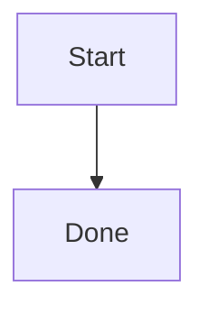

This guide covers how to add and edit pages on the Bamboo documentation site itself.
For contributing to the Bamboo **code** (agents, extractors, database backends, tests),
see the [Development Guide](/bamboo/development/).

The site is built with [Astro Starlight](https://starlight.astro.build) and lives under
`website/` in the repository.

## Run the docs locally

Node 20+ is required. From the `website/` directory:

```bash
npm install
npm run dev       # dev server at http://localhost:4321/bamboo/
npm run build     # production build → dist/ (also validates all internal links)
npm run preview   # serve the production build locally
```

The `dev` and `build` scripts first run `docs:api`, which regenerates the OpenAPI
reference (see [API reference](#api-reference) below).

## Where pages live

```
website/
├── src/content/docs/   Markdown/MDX pages (the docs content)
├── src/assets/         Images optimized by Astro (e.g. the logo)
├── public/             Static files served as-is (favicon, and api/)
└── astro.config.mjs    Site config: base path, sidebar, plugins
```

Every page is a file under `src/content/docs/`. Use **`.md`** by default; use **`.mdx`**
only when a page needs JSX/Starlight components (the landing page, `index.mdx`, is the
one example in this repo).

## Frontmatter

Each page starts with a YAML frontmatter block. `title` is required; `description` is
optional but recommended (it sets the page's meta description):

```md
---
title: Page Title
description: One-line summary of the page.
---
```

The landing page additionally uses `template: splash` with a `hero` block — see
`src/content/docs/index.mdx`.

## Links

The site is served under the `/bamboo/` base path, so internal links must be written as
**root-absolute paths that include the base**:

```md
See the [Task Analysis guide](/bamboo/guides/analyze/).
```

Do **not** use relative links like `./analyze/`. The build runs
`starlight-links-validator`, which **fails on any broken internal link or heading
anchor**, so a typo in a link will break the build. The static `/bamboo/api/` path is
excluded from validation because it is not an Astro route.

## Adding a page to the sidebar

Creating a file does not add it to the navigation. Register it in the `sidebar` array in
`astro.config.mjs` using its slug:

```js
{ label: 'My New Page', slug: 'my-new-page' },
```

Items can be grouped under a labelled section with an `items` array — see the existing
`Guides` and `Architecture` groups in `astro.config.mjs`.

## Components and asides

Starlight provides admonitions, which work in plain `.md`:

```md
:::tip
Helpful aside.
:::

:::note[Custom title]
A note with a custom title.
:::
```

Richer components — `<Tabs>`, `<CardGrid>`, `<LinkCard>` — require an `.mdx` page. See
`src/content/docs/index.mdx` for live usage.

## Diagrams

Mermaid diagrams are written as ` ```mermaid ` fenced code blocks and rendered
client-side by `astro-mermaid`. They follow the page's light/dark theme automatically:

````md

````

## Code blocks

Code blocks use a single dark theme (`dracula`) in **both** light and dark mode, so a
fenced block always renders dark regardless of the reader's theme. There is nothing to
configure per page — just write a normal fenced code block with a language hint.

## API reference

`npm run docs:api` runs the Redocly CLI to build `openapi/bamboo.yaml` into
`public/api/index.html`, served at `/bamboo/api/` and linked from the sidebar. The `dev`
and `build` scripts run this automatically.

## Editing and publishing

Every page has an **"Edit this page"** link in the footer that opens the GitHub editor
for that file. To publish, merge your change to `master`: pushes that touch `website/**`
trigger the `.github/workflows/docs.yml` workflow, which builds the site and deploys it
to GitHub Pages. The workflow can also be run manually via **workflow_dispatch** from the
Actions tab.
